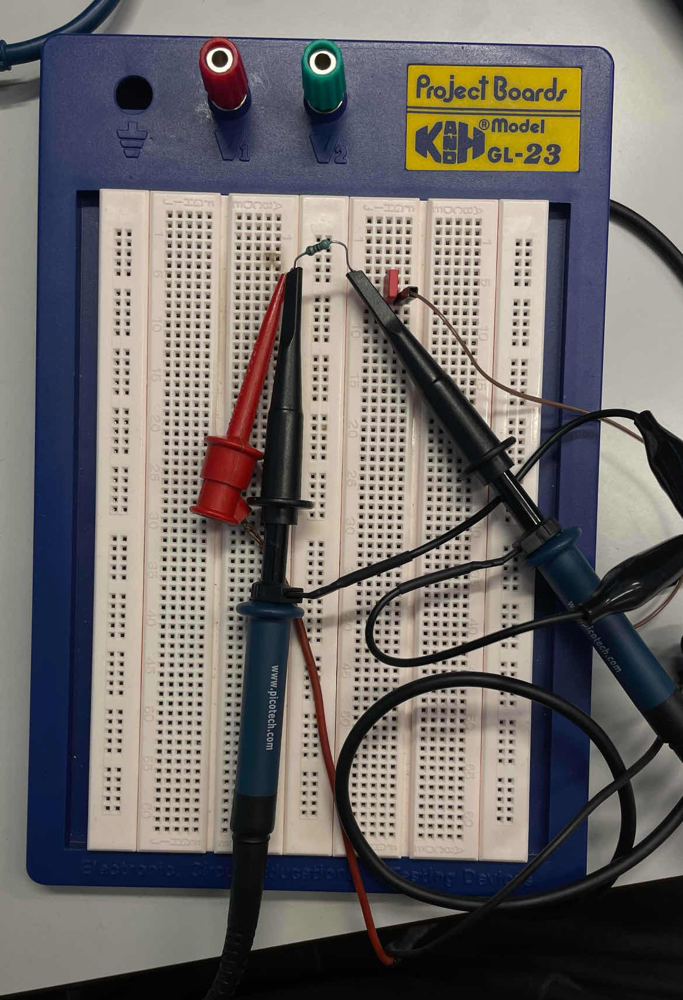
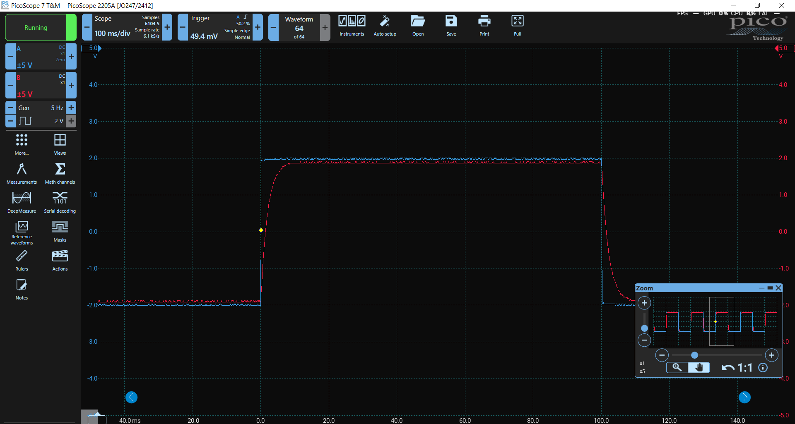

## Group Information
**Student Names**: Przemyslaw Lasecki  
**Student number**: 2203535  
**Lab Title:** Lab 3 - Transient Analysis of Step Response in RC and RL Circuits

---

## Introduction

This report focuses on the transient analysis of RC and RL circuits. The goal is to observe through LTSpice simulations and lab measurements, and then compare the results.

---

## Part 1: RC Circuit Simulation and Lab Measurements

### Circuit Description

This is a simulation of an RC circuit with the following component values:
- **R** = (35+10)45.3 kΩ 
- **C** = (35+1)36 nF
- **Step Voltage** = 2.2 V

The voltage source generates a step input at 1 ms, transitioning from 0V to 2.2V. The goal is to observe the voltage across the capacitor as it charges over time.

### Task 1: RC Circuit Current Calculation

The current in an RC circuit decays exponentially as the capacitor charges. The current at any time \( t \) can be calculated using the formula:

$$
I(t) = \frac{V}{R} \cdot e^{-\frac{t}{\tau}}
$$
Where:
- \( I(t) \) is the current at time \( t \).
- \( V \) is the initial voltage across the resistor.
- \( R \) is the resistance in the circuit.

$$
I(t) = \frac{2.2}{45.3 \, \text{k}\Omega} \cdot e^{-\frac{t}{1.63 \, \text{ms}}}
$$

Extract the half-time from the step response and validate it against the theoretical value \( \tau = RC \).

For the simulated RC circuit, using the values \( R = 45.3 \, \text{k}\Omega \) and \( C = 36 \, \text{nF} \), the time constant \( \tau \) is:

$$
\tau = R \times C = 45.3 \, \text{k}\Omega \times 36 \, \text{nF} = 1.63 \, \text{ms}
$$

The half-time \( t_{1/2} \) can be calculated using the following relation, where \( t_{1/2} \) is the time when the voltage across the capacitor reaches half of its final value:

$$
t_{1/2} = \tau \cdot \ln(2) \approx 1.63 \, \text{ms} \times 0.693 = 1.13 \, \text{ms}
$$

### Schematic and simulation

*Figure 1: Schematic of the RC Circuit simulated in LTSpice. Current is plotted on the negative axis but is aligned with correct values.*

### Analysis

- The voltage across the capacitor follows an exponential charging curve, approaching 2.2V after several time constants.
- The current through the capacitor decays exponentially as it charges.

---

## Part 2: RL Circuit Simulation

### Circuit Description

The RL circuit is simulated with the following component values:
- **Resistor (R)** = (53 + 20)=73Ω
- **Inductor (L)** = (35 + 2)= 37µH
- **Step Voltage** = (22 / 10)= 2.2 V

The goal is to observe the current through the inductor and the voltage across it over time in response to the step voltage input.

### Schematic and simulation

*Figure 2: Schematic of the RL Circuit simulated in LTSpice. Current is plotted on the positive axis.*

### Analysis

- The current through the inductor starts at 0 and gradually increases as the inductor opposes changes in current initially, then allows it to flow more freely over time.
- The voltage across the inductor decays as the current increases.

---

## Part 3: Lab Measurements (RC Circuit)

### Component Values Used in Lab:

- **Resistor (R)**: 47 Ω (lab value, simulated value: 45.3 kΩ)
- **Capacitor (C)**: 47 nF (lab value, simulated value: 36 nF)
- **Step Voltage**: 2.2 V

### Signal Generator Configuration

To generate the step input, the signal generator was set with the following parameters:

- **Initial Voltage**: 0 V
- **Final Voltage**: 2.2 V
- **Frequency**: 10 Hz (low enough for the capacitor to fully charge before the next pulse)
- **Waveform**: Square wave (mimicking a step input)

### Oscilloscope Setup

The oscilloscope was used to measure the **voltage across the capacitor** over time to capture the charging behavior. The steps followed were:

1. **Circuit Connection**: The signal generator was connected in series with the resistor and capacitor, and the oscilloscope probes were placed across the capacitor.
2. **Measurement of Voltage**: The voltage across the capacitor was recorded, showing the expected exponential rise as it charged.

### Captured Data

- **Breadboard Setup**: A photo of the physical RC circuit setup on the breadboard.  

- **Oscilloscope Screenshot**: A screenshot showing the **voltage across the capacitor** over time.  

### Observations

- The **real-world time constant** was calculated from the oscilloscope measurement and compared with the theoretical time constant:
$$
\tau = R \times C = 47 \, \Omega \times 47 \, \text{nF} = 2.21 \, \mu s
$$

- This value differed slightly from the simulated value due to minor variations in component values.

### Conclusion

The real-world RC circuit's behavior matched the simulated circuit's performance, with the capacitor charging curve closely following the expected exponential form. The time constant observed in the lab was consistent with theoretical calculations based on the lab component values. Used components were little bit different size but output is similar. 