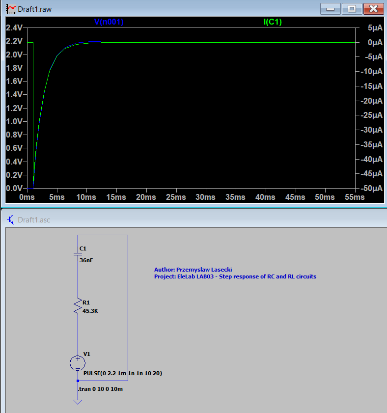
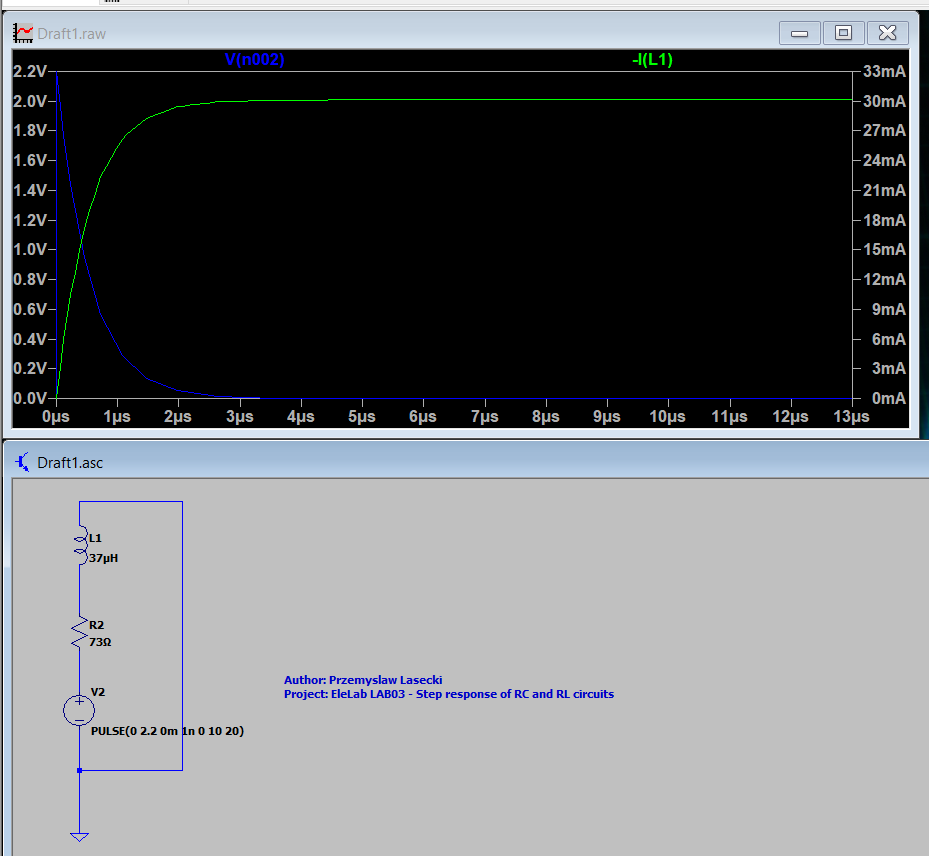

# Transient Analysis of Step Response in RC and RL Circuits

## Group Information
- **Student Names**: Przemyslaw Lasecki
- **Student number**: 2203535

---

## Introduction

This report covers the transient analysis of RC and RL circuits. The circuits are analyzed for their step response using LTSpice simulations.

## Part 1: RC Circuit Simulation and Lab Measurements

### Circuit Description

This is a simulation of an RC circuit with the following component values:
- **R** = 45.3 kΩ 
- **C** = 36 nF
- **Step Voltage** = 2.2 V

The voltage source generates a step input at 1 ms, transitioning from 0V to 2.2V. The goal is to observe the voltage across the capacitor as it charges over time.

### Schematic and simulation

*Figure 1: Schematic of the RC Circuit simulated in LTSpice.*

### Analysis

- The voltage across the capacitor follows an exponential charging curve, as expected, approaching 2.2V after a few time constants.
- The current through the capacitor decays exponentially as the capacitor charges up.

---

## Part 2: RL Circuit Simulation

### Circuit Description

The RL circuit is simulated with the following component values:
- **Resistor (R)** = (53 + 20)=73Ω
- **Inductor (L)** = (35 + 2)= 37µH
- **Step Voltage** = (22 / 10)= 2.2 V
- **Time delay** = 1 ms

The goal is to observe the current through the inductor and the voltage across the inductor over time in response to the step voltage input.

### Schematic and simulation

*Figure 3: Schematic of the RL Circuit simulated in LTSpice.*

### Analysis

- The current through the inductor starts at 0 and increases over time as the inductor opposes the change in current initially, then slowly allows current to flow.
- The voltage across the inductor decays as the current increases.

---

## Part 3: Lab Measurements (RC Circuit)

### Procedure

The lab measurements for the RC circuit will be conducted using a signal generator (Picoscope) to create a square wave input and observe the capacitor's voltage response.

- **Square wave frequency**: Set low enough so that the output voltage has enough time to settle before the next pulse.
- **Measurement equipment**: Use the Picoscope Arbitrary Waveform Generator (AWG) for generating the pulse train.

### Measured Values

- Capture screenshots of the measured voltage across the capacitor and current through the resistor.

### Analysis

- Compare the measured half-time and final voltage with the theoretical and simulated values.
- Provide explanations for any discrepancies between simulation and experimental results.

---

## Conclusion

- The RC and RL circuits were successfully simulated, and the transient responses matched the theoretical predictions.
- The RC circuit's half-time and the RL circuit's current growth confirmed the calculated time constants.
- In the lab measurement phase, the RC circuit's behavior will be further verified, with lab results compared to simulations.

---

## References

(Add references here if any external sources were used)

